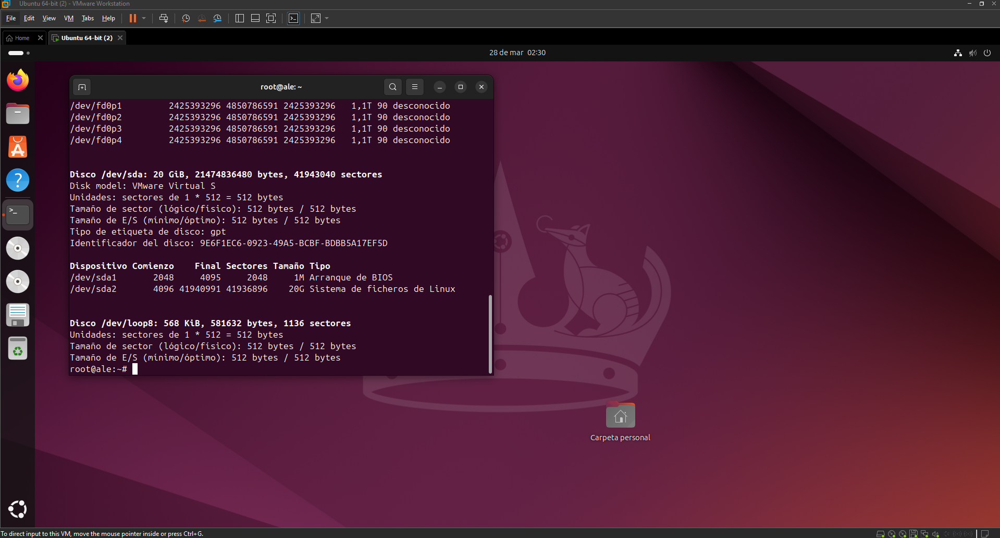
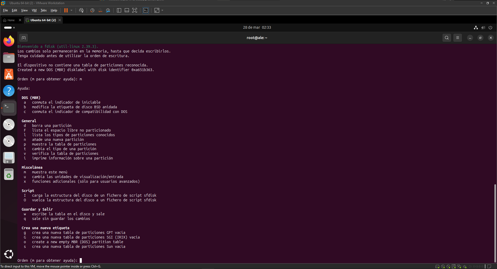

# Particionar discos

## PASO 1: Información sobre dispositivos:

| Comando       | Descripción |
|--------------|------------|
| `fdisk -l`  | Muestra los discos disponibles y las particiones creadas. |
| `blkid`     | Proporciona información sobre el UUID y el tipo de sistema de archivos. |
| `df`        | Muestra información sobre los sistemas de archivos montados y el espacio ocupado. |
| `df -h`     | Muestra el tamaño de los sistemas de archivos en unidades legibles para humanos. |
| `df -T`     | Muestra el tipo de sistema de archivos junto con la información de uso del disco. |


## PASO 2: PARTICIONAMOS EL DISCO




Usamos 
````
fdisk [Nombre_dispositivo]
````




Si presionamos **m** nos saldra todas las opciones.

## PASO 3: FORMATEAR

| Comando                    | Descripción                               |
|----------------------------|-------------------------------------------|
| `mkfs.ext3 <dispositivo>`   | Crea un sistema de archivos **ext3** en el dispositivo especificado. |
| `mkfs.ext4 <dispositivo>`   | Crea un sistema de archivos **ext4** en el dispositivo especificado. |
| `mkfs.vfat <dispositivo>`   | Crea un sistema de archivos **FAT32** (vfat) en el dispositivo especificado. |
| `mkfs.ntfs <dispositivo>`   | Crea un sistema de archivos **NTFS** en el dispositivo especificado. |


