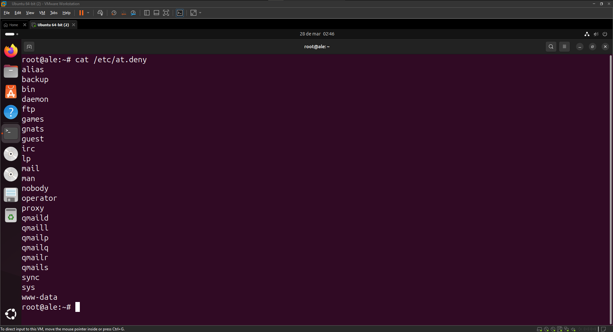
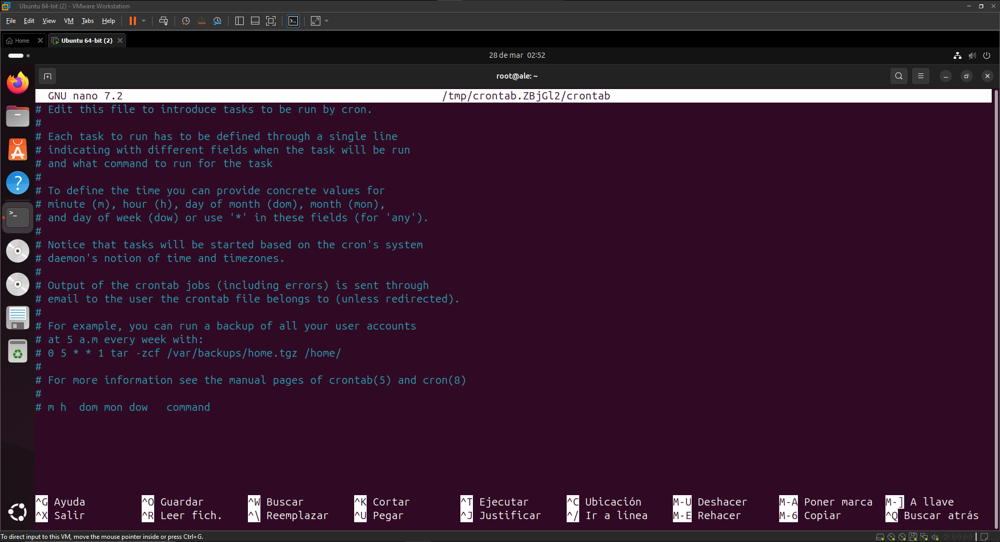

# Programación de tareas

````
at
````
| **Opción**          | **Descripción**                                                                 |
|---------------------|---------------------------------------------------------------------------------|
| `-f [archivo]`      | Ejecuta un script o comando desde un archivo especificado.                      |
| `-m`                | Envia un mensaje de correo cuando se completa la tarea programada.              |
| `-v`                | Muestra la hora de ejecución del trabajo.                                       |
| `-q [cola]`         | Especifica una cola para el trabajo, por ejemplo, "a", "b", etc.               |
| `-c`                | Permite especificar el directorio de trabajo para el comando a ejecutar.       |
| `-l`                | Muestra el contenido de la cola de trabajos de `at`.                            |
| `-r`                | Elimina un trabajo previamente programado.                                      |

````
atq
````
| **Opción**          | **Descripción**                                                                 |
|---------------------|---------------------------------------------------------------------------------|
| `-l`                | Muestra la lista de trabajos programados en la cola de `at`.                    |
| `-q [cola]`         | Muestra los trabajos programados en una cola específica (por ejemplo, "a", "b", etc.). |
| `-v`                | Muestra información detallada de los trabajos en la cola, como el nombre del usuario y la fecha. |
| `-r`                | Elimina un trabajo de la cola (debe ser especificado junto con el ID del trabajo). |

````
atrm
````
| **Opción**          | **Descripción**                                                                 |
|---------------------|---------------------------------------------------------------------------------|
| `[ID trabajo]`      | Elimina el trabajo programado con el ID especificado.                           |
| `-a [usuario]`      | Elimina todos los trabajos programados para un usuario específico.             |


> ⚠️ **at.deny**: 
> - Archivo de configuración en `/etc/at.deny`.
> - Controla qué usuarios **NO** pueden usar el comando `at` para programar trabajos.
> - Si el archivo existe, los usuarios listados no podrán usar `at`.
> - Si no existe, todos los usuarios pueden usar `at`, excepto los listados en `/etc/at.allow` (si existe).




````
crontab
````


| Comando    | Descripción                                                                 | Sintaxis                                                              |
|------------|-----------------------------------------------------------------------------|-----------------------------------------------------------------------|
| `crontab`  | Comando para editar, instalar y eliminar cron jobs.                          | `crontab [opciones] [archivo]`                                        |
| `crontab -e` | Editar el archivo crontab del usuario actual.                               | `crontab -e`                                                          |
| `crontab -l` | Listar los cron jobs del usuario actual.                                   | `crontab -l`                                                          |
| `crontab -r` | Eliminar el crontab del usuario actual.                                     | `crontab -r`                                                          |
| `crontab -i` | Confirmación antes de eliminar el crontab del usuario.                      | `crontab -ri`                                                         |
| `crontab -u usuario` | Gestionar el crontab de otro usuario (requiere privilegios de superusuario). | `crontab -u usuario [opciones]`                                        |

````
⚠️ El fichero de configuración de crontab tiene una sintazis muy concreta y esta definida en los comentarios del propio fichero ⚠️

````


